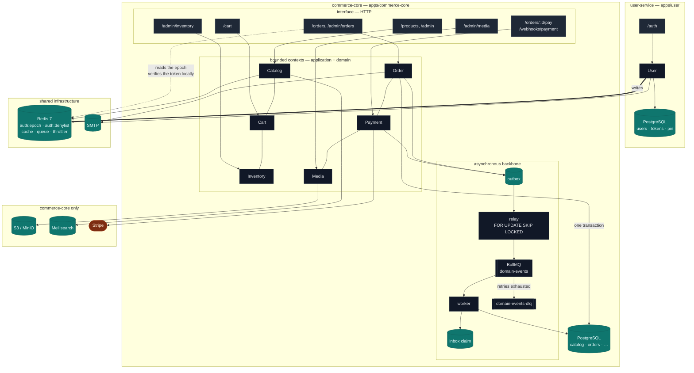

# JCool E-commerce Backend

Single-store e-commerce backend built as a **NestJS monorepo** — seven bounded contexts across two
deployables, Clean Architecture layering enforced by a build gate, and a deliberate focus on the
parts of commerce that are hard: **never oversell, never double-charge, never lose an event**.

<p>
  <a href="https://github.com/jCool10/jcool-ecommerce-backend/actions/workflows/ci.yml"></a>
  
  
  
  
  
  
  
  
</p>

| | |
| --- | --- |
| **Scale** | 2 deployables · 7 bounded contexts · 577 TypeScript files · 22 tables across 2 databases · 24 committed migrations in 2 journals · 53 HTTP routes |
| **Tests** | 1,180 unit tests (163 files, hermetic) + 64 integration suites on real Postgres, Redis, MinIO, Meilisearch and SMTP via Testcontainers |
| **Gates** | `lint` → `typecheck` → `arch:check` (10 boundary rules) → `npm audit` → `build` → both migration journals → Prometheus rule tests → coverage-floored unit + e2e |

---

## Contents

- [What this is](#what-this-is) · [Architecture](#architecture) · [Engineering highlights](#engineering-highlights)
- [Quick start](#quick-start) · [Configuration](#configuration) · [API](#api)
- [Testing](#testing) · [Observability](#observability) · [Operations](#operations)
- [Known limits](#known-limits) · [Scripts](#scripts)

---

## What this is

A backend for a **single-store** (not multi-vendor) shop, built as independent bounded contexts with
boundaries a build step enforces — so a context can be extracted into its own service as a bounded
piece of work rather than a rewrite. User is the one that has been: it runs as its own deployable on
its own database, and the extraction cost no redesign.

Four invariants drive nearly every design decision in the repository:

| Invariant | How it is held |
| --- | --- |
| **Never oversell** | Stock is held inside the checkout transaction, under a row lock or a version CAS, with three Postgres `CHECK` constraints as the data-layer backstop |
| **Never double-charge** | One purchase intent ⇒ one payment: a client `Idempotency-Key`, a partial-unique index on active payments, and webhook dedup on `(provider, event_id)` |
| **Money and stock stay consistent with order state** | Order, stock hold, outbox event and idempotency result commit or roll back as one transaction; settlement does the same for the status flip |
| **The order is the transaction source of truth** | Order snapshots each line's price and name; the cart never does — a later reprice cannot move a placed order |

**Not in scope, deliberately:** multi-vendor, automatic refunds, and a deployed tracing collector.
Where a guarantee is weaker than it looks, [Known limits](#known-limits) says so.

---

## Architecture

Two deployables from one image. They share no database and call each other not at all: the only
things that cross the line are a signed access token and two Redis keys.



### Bounded contexts

| Context | Owns | Publishes to other contexts |
| --- | --- | --- |
| **User** *(own service, own database)* | Accounts, credentials, sessions, RBAC, sharding-ready ids | — (nothing; identity travels in the access token) |
| **Catalog** | Categories, products, SKUs, prices, product images, search index | `CATALOG_SKU_QUERY` (live price/name) |
| **Cart** | Per-user cart lines — quantities only, no prices | `CART_SNAPSHOT` (`{skuId, quantity}`) |
| **Inventory** | Stock levels and reservations | `STOCK_RESERVATION` (reserve / commit / release) |
| **Order** | The order aggregate, its state machine, checkout and settlement | `ORDER_PAYMENT_VIEW`, `FinalizeOrderUseCase` |
| **Payment** | Gateway sessions, webhook sink, reconciliation | — (settles Order through Order's own use case) |
| **Media** | Upload lifecycle, presigned URLs, reclaim sweep | `MEDIA_QUERY`, `MEDIA_FACADE` |

No context reads another's tables. Cross-context calls go through an anti-corruption adapter the
*calling* context owns, bound to the target's published port — there are no cross-context foreign
keys anywhere in the schema, which is what keeps an extraction from becoming a schema migration.

User is the proof: it now runs as its own service on its own Postgres, and the extraction changed no
other context's code. It publishes nothing because it needs to — commerce-core reads the buyer's
identity out of the access token it verifies locally, and an order snapshots the address it was
placed with onto its own row.

### Layering

Dependencies point inward; infrastructure is plugged in through ports declared by the inner layers.

```
interface  ──▶  application  ──▶  domain          (framework-free, no DB, no telemetry)
                     ▲                 ▲
                     └──── implements ─┴──── infrastructure   (Drizzle, Redis, S3, Stripe, SMTP)
```

`npm run arch:check` (dependency-cruiser, 10 error-severity rules) fails the build when `domain`
imports a framework or a driver, when `application` imports `infrastructure` or `interface`, when one
context reaches into another for anything but its `application/public` surface — internal use cases
included, which is the crossing a boundary rule usually forgets — or when `domain`/`application`
import **any** telemetry
package. That last rule is mechanical because the leak is easy: the observability barrel transitively
pulls `@opentelemetry/api`, so one stray import would put a tracing dependency in a domain entity.
Two more hold the monorepo shape: a library may not import an app, and an app may not import another
app — which now has teeth, because commerce-core and user-service are separate processes on separate
databases and a single import edge would be a compile-time lie about that. ESLint adds two
file-scoped fences of its own — no `async`/`await` in the id generator, and no `uuid`/`randomUUID` in
user infrastructure.

There are **no exemptions**. The two wirings that used to need one — the event dispatch table and the
schema barrel — now live in the app and reach the libraries through a token instead:
`DOMAIN_EVENT_DISPATCHER` / `EVENT_LABEL_REGISTRY` for the first, `DrizzleModule.forRoot(schema)` for
the second. That inversion is what keeps the relay, the queue processor and the dead-letter router in
a library no app owns.

### Project layout

Two deployables, laid out as `apps/` + `libs/`. One `package.json`, one lockfile, one image — the
separation is enforced by `arch:check` and by each app owning its own database, not by package
boundaries.

```
apps/
├── commerce-core/
│   ├── drizzle.config.ts    # its own drizzle-kit config
│   ├── migrations/          # drizzle-kit journal (the app owns its schema)
│   └── src/
│       ├── main.ts          # bootstrap: helmet, CORS, cookies, ValidationPipe, Swagger, shutdown hooks
│       ├── instrumentation.ts  # OTel + Sentry, preloaded via `node --import` before Nest boots
│       ├── app.module.ts
│       ├── modules/         # bounded contexts — each: domain / application / infrastructure / interface
│       │   ├── cart/  catalog/  inventory/  media/  order/  payment/
│       ├── messaging/       # the dispatch table: which handler applies which event (app-owned)
│       ├── database/        # schema barrel (every context's tables) + seed
│       └── storage/         # bucket ↔ database reconciliation CLI
└── user/                    # the auth issuer — no queue, no outbox, no inbox
    ├── drizzle.config.ts
    ├── migrations/          # a separate journal against a separate Postgres
    └── src/
        ├── main.ts  instrumentation.ts  app.module.ts
        ├── modules/user/    # accounts, sessions, tokens, RBAC, id minting
        └── database/        # its five tables
libs/                        # shared by every app; may never import one back
├── kernel/                  # framework-free DDD building blocks (Money, Entity, DomainError, Result)
├── config/                  # env validation (fail-fast) + typed config factory
├── messaging/               # outbox, relay, BullMQ queue, inbox, DLQ + replay CLI (transport only)
├── observability/           # correlation, pino logging, OTel tracing, Prometheus metrics, Sentry
├── db/  redis/  storage/    # pg pool + Drizzle, Redis + SWR cache, object storage
├── identity/                # UUIDv8 generator/codec, HMAC email buckets
├── platform/                # health, throttler, idempotency, retention, HTTP filters/controllers
├── rbac/  mail/  resilience/
test/
├── integration/             # 64 e2e suites on real infrastructure (Testcontainers)
│   └── cross-app/           # the one flow that spans both services: a token minted, then spent
├── setup/                   # global setup, app factory, fixtures, per-suite side containers
└── load/                    # k6 mixes
infra/                       # Prometheus rules + promtool tests, Grafana dashboard, OTel Collector
k6/  scripts/  .github/workflows/
```

---

## Engineering highlights

The parts worth reading the code for. Each row names the file to open.

### Concurrency and consistency

| Problem | Approach | Where |
| --- | --- | --- |
| **Oversell under contention** | Two interchangeable strategies behind one port, picked by `INVENTORY_LOCK_STRATEGY`: pessimistic `SELECT … FOR UPDATE`, or a version CAS with bounded retry. Both run **inside the caller's transaction**, so the hold commits with the order. Three `CHECK` constraints (`ck_stock_on_hand_nonneg`, `ck_stock_reserved_nonneg`, `ck_stock_no_oversell`) make the database the final authority | `modules/inventory/infrastructure/stock.repository.ts` |
| **Checkout atomicity** | One transaction inserts the placed order and its price-snapshot lines, takes the stock hold, appends the `order.placed` outbox row, and flips the idempotency key to `COMPLETED`. A stock shortfall rolls back all four — no order, no event, no key blocking the retry | `modules/order/application/use-cases/checkout-order.use-case.ts` |
| **Exactly-once settlement** | Every path that settles an order (webhook, queue consumer, reconcile sweep, buyer cancel, admin cancel) funnels through one `FinalizeOrderUseCase`: `SELECT … FOR UPDATE` on the order row plus a terminal-status guard. No distributed lock. It can **join** a caller's transaction so a consumer's inbox claim and the settlement commit together | `modules/order/application/use-cases/finalize-order.use-case.ts` |
| **Duplicate checkout requests** | Two layers: a per-`(scope, key)` idempotency entry gate that replays the first response body and status, and a `UNIQUE (user_id, idempotency_key)` index on `orders` as the backstop. A key reused with a different request body is `422`, not a silent replay | `modules/order/application/ports/idempotency-store.port.ts` |
| **Refresh-token theft** | Rotation runs in one `FOR UPDATE` transaction. Presenting a token that was already replaced or revoked revokes the **entire family**, not just that token — and revocation is checked before expiry, so a retired token still reads as reuse rather than as an expiry | `modules/user/infrastructure/drizzle-refresh-token.repository.ts` |

### Distributed systems

| Problem | Approach | Where |
| --- | --- | --- |
| **The dual-write problem** | Events are rows written by the same transaction as the change they describe. A relay polls `published_at IS NULL` with `FOR UPDATE SKIP LOCKED`, publishes to BullMQ and marks the row published in one transaction — at-least-once, safe on every replica, no leader election | `shared/messaging/outbox/outbox-relay.ts` |
| **At-least-once → exactly-once** | The consumer claims `message_id = outbox.id` in an `inbox` table (`UNIQUE (consumer, message_id)`) and runs the handler **in that same transaction**. A redelivery loses the claim and does nothing; a handler that throws takes its claim down with it, so the redelivery does the work | `shared/messaging/queue/domain-event.processor.ts` |
| **Sweeping the inbox safely** | Inbox claims are swept on a schedule (`RETENTION_INBOX_DAYS`, default 30d), and the app **refuses to boot** if that retention is shorter than the queue's failed-job horizon — deleting a claim while its message can still be redelivered would apply the effect twice | `shared/messaging/inbox/sweep-inbox.ts` |
| **Poison messages** | BullMQ retries with backoff to a bounded attempt budget (`QUEUE_CONSUMER_ATTEMPTS`, default 8 including the first delivery), then routes to `domain-events-dlq`. `npm run queue:replay-dlq` interrogates the inbox before re-publishing, so replaying a job whose effect already landed is a no-op. Dry run is the default | `shared/messaging/queue/dead-letter.replay.ts` |
| **Payment saga convergence** | Three paths settle an order, in descending priority: the HMAC-verified webhook, a durable `payment.succeeded`/`payment.failed` event, and a polling reconciliation sweep that probes the gateway for orders stuck `PENDING` and doubles as TTL expiry. Whichever arrives first wins; the rest are no-ops under the terminal guard | `modules/payment/application/use-cases/reconcile-stale-orders.use-case.ts` |
| **Trace continuity across the async hop** | The outbox writer captures the W3C `traceparent` at insert, so one trace runs from HTTP request through outbox insert, relay publish and consumer handler | `shared/observability/tracing/propagation.ts` |

### Performance and caching

| Problem | Approach | Where |
| --- | --- | --- |
| **Thundering herd on cache expiry** | Reads go through stale-while-revalidate behind a Redis **single-flight rebuild lock** with a lease and jitter: one request rebuilds, everyone else is served the stale value. `cache_rebuild_duration_seconds` measures the rebuild | `shared/cache/swr-cache.service.ts`, `shared/cache/single-flight.lock.ts` |
| **Catalog-wide invalidation** | A generation counter, not key enumeration: bumping one Redis integer retires every catalog key at once, in O(1). Staleness after a *missed* invalidation is bounded by `CATALOG_CACHE_TTL_SEC` **plus** the shared stale window and jitter (≈100s at defaults) | `modules/catalog/infrastructure/caching-product.repository.ts` |
| **Cache poisoning across deploys** | The cache codec re-validates every field on read, so a shape change between deploys degrades to a cache refill instead of a 500 | `modules/catalog/infrastructure/product-cache.codec.ts` |
| **Presigned URLs vs cached documents** | Catalog stores **asset ids, never URLs**. A presigned URL outlives its cache entry by minutes and the entry by hours, so URLs are resolved *after* the cache read — one batched call per response page. An id whose asset has since gone is dropped rather than rendered as a broken image | `modules/catalog/application/use-cases/get-product-detail.use-case.ts` |
| **Unbounded cache keys** | Every query parameter is part of the cache-key fingerprint, so each is bounded at the DTO edge: `page ≤ 10000`, `pageSize ≤ 100`, `categorySlug` must match the slug pattern. An unbounded field would be an unbounded number of cache keys as well as an unbounded query | `modules/catalog/interface/dto/list-products-query.dto.ts` |
| **Deep pagination cost** | Count and page are read inside one repeatable-read read-only snapshot with a tie-broken sort, so the total and the rows cannot disagree | `modules/catalog/infrastructure/drizzle-product.repository.ts` |

### Security

| Problem | Approach | Where |
| --- | --- | --- |
| **Immediate JWT revocation** | ES256 access tokens carry `{sub, role, jti, epoch}` and are re-checked per request against a Redis `jti` denylist (one token) and the projected `token_epoch` (every token issued before a logout-all or password change). Verification holds a public key and Redis only — no private key, no database — so it can be split off with the services that need it; a missing epoch is a rejection, never an assumed `0` | `libs/auth/src/jwt.strategy.ts` |
| **Token delivery and CSRF** | The access token goes in the JSON body (Bearer is CSRF-immune). The refresh token goes **only** in an `httpOnly; SameSite=Strict; Path=/auth` cookie (`Secure` in production, per `COOKIE_SECURE`), paired with a signed double-submit CSRF cookie enforced on the two routes that consume it | `modules/user/interface/security/csrf.guard.ts` |
| **Brute force** | Three Redis-backed tiers with different keys: `default` by IP (100/60s app-wide floor), `account` by IP + SHA-256(email) on auth routes (5/15min, 15min block), `user` by authenticated id on write routes (10/60s) — the tier an attacker cannot outrun by rotating IPs | `shared/infrastructure/throttler/throttler.constants.ts` |
| **User enumeration** | `forgot-password` and `resend-verification` always answer `202`. Login runs a real argon2 verify against a cached dummy hash on the unknown-email branch, so the timing of "no such user" matches "wrong password" | `modules/user/application/use-cases/login-user.use-case.ts` |
| **Webhook authenticity** | HMAC-SHA256 over the **raw request bytes** (`rawBody: true` — the JSON parser would re-serialize and break the signature), constant-time compare, plus a `±PAYMENT_WEBHOOK_TOLERANCE_SEC` replay window. Exempt from both throttle tiers so a burst of legitimate gateway retries is never rate-limited away | `modules/payment/infrastructure/gateway/hmac-signature.ts` |
| **Metrics endpoint disclosure** | A wrong or missing `METRICS_TOKEN` returns a plain `404`, never `401` — a `401` confirms the endpoint exists to anyone probing. (With no token configured at all, `/metrics` is open in development and `404` in production.) | `shared/observability/metrics/metrics.guard.ts` |

### Data modelling

| Problem | Approach | Where |
| --- | --- | --- |
| **Sharding-ready user ids** | Every user-context id is a UUIDv8 (RFC 9562 §5.8) laid out `48 ts_ms │ 4 ver │ 12 bucket │ 2 var │ 10 node │ 12 seq │ 40 random`. The 12-bit routing bucket is `HMAC(IDENTITY_BUCKET_KEY, normalized_email) mod 4096` — derived from the same normalized email the `UNIQUE(email)` index sees, so a future shard split routes from the id alone, with no lookup table, and email uniqueness survives it | `shared/identity/uuid-v8.generator.ts` |
| **Why HMAC, not a hash** | `users.id` is public. An unkeyed digest would turn every published id into an offline oracle for "does this address have an account here". The key is **permanent**: the database pins its fingerprint on first boot and refuses a later boot under a different key | `modules/user/infrastructure/identity-bucket-key.verifier.ts` |
| **Money** | Integer minor units (VND đồng, USD cents) in a `Money` value object — never a float. Cross-currency operations throw rather than coerce. The order total is computed once from the lines and then persisted, never recomputed against a live price | `shared/kernel/money.vo.ts` |
| **Media lifecycle as stock reservation** | An upload commits to something before knowing whether the caller will finish, so it is modelled like a stock hold: `PENDING → READY → ATTACHED → DETACHED`, plus `SWEEPING` as a terminal claim. `expires_at` is `NULL` in exactly one state (`ATTACHED`) — an asset no sweep can select is exactly what that state needs and exactly the leak every other state must not have | `modules/media/domain/asset-state-machine.ts` |
| **Deleting bytes safely** | The sweep commits its `SWEEPING` claim **first**, then deletes the object, then the row. A crash mid-way leaves an orphan row whose object is gone — re-scannable, and deleting an absent object is a no-op. The other order leaves bytes nobody has a pointer to: unfindable and paid for indefinitely | `modules/media/application/use-cases/sweep-abandoned-assets.use-case.ts` |
| **Deadlock avoidance** | Attaching an image claims the asset and writes the link row in one transaction, always taking `product_images` before `media_assets`, so two concurrent edits of the same asset cannot deadlock | `modules/catalog/infrastructure/drizzle-catalog-admin.repository.ts` |

---

## Quick start

**Prerequisites:** Node ≥ 22.9, npm, Docker (for infrastructure and the integration tests).

```bash
# 1. install
npm ci

# 2. configure — one file per service, both pointed at the Compose stack below
cp .env.example .env
cp .env.user.example .env.user

# 3. mint the ES256 pair — no key is committed, so neither service boots without this
openssl ecparam -name prime256v1 -genkey -noout -out jwt-es256.key
openssl ec -in jwt-es256.key -pubout -out jwt-es256.pub
base64 < jwt-es256.key | tr -d '\n'   # JWT_ES256_PRIVATE_KEY → .env.user only
base64 < jwt-es256.pub | tr -d '\n'   # JWT_ES256_PUBLIC_KEY  → both files
openssl rand -base64 48               # IDENTITY_BUCKET_KEY   → .env.user only

# 4. infrastructure (the ports below are the host-mapped ones)
docker compose up -d postgres postgres-user redis meilisearch mailpit minio minio-init

# 5. schema + sample data — two journals, two databases
npm run db:migrate
npm run db:migrate:user
npm run db:seed

# 6. run both services (separate terminals)
npm run start:dev
npm run start:dev:user
```

- commerce-core → <http://localhost:3000> · OpenAPI → <http://localhost:3000/docs>
- user-service (`/auth/*`) → <http://localhost:3001> · OpenAPI → <http://localhost:3001/docs>
- Mail inbox (Mailpit) → <http://localhost:8025> · MinIO console → <http://localhost:9001>
- Postgres → `localhost:5433` · user Postgres → `localhost:5434` · Redis → `localhost:6380` ·
  Meilisearch → `localhost:7700`

A mismatched public key is not a boot failure — commerce-core simply rejects every token
user-service mints, so keep `JWT_KEY_ID` identical in both files too.

`minio-init` is a one-shot that creates `STORAGE_BUCKET` and exits; the app waits on it, so a fresh
`docker compose up` has a bucket before the first upload. Meilisearch is only needed with
`SEARCH_ENABLED=true`. Skipping Mailpit does **not** fall back to the log sink — `.env.example` ships
`SMTP_URL` uncommented, so sends would fail against a dead relay; comment it out to use the log sink.

Full stack in-network (both apps included): `docker compose up -d --build`. That also brings up
`commerce-core-migrate` and `user-migrate`, two one-shot containers each app waits on, so the
schemas are applied before either process starts serving. In the compose network user-service is
published on host `3002` (Grafana already owns 3001).
Tear down including volumes: `docker compose down -v`.

---

## Configuration

Environment is validated **once at startup** and the process refuses to boot on anything invalid —
a missing secret is a crash, not a runtime surprise. Each service validates against its own schema:
a shared base plus `UserEnvironmentVariables` for the three variables only the issuer may hold.
Unknown keys are ignored on both sides, deliberately — the e2e harness runs both apps in one
`process.env`, and a schema that *rejected* a sibling's variable would break it.

`.env.example` (commerce-core) and `.env.user.example` (user-service) are the complete, commented
references. The variables without a default:

| Variable | Service | Notes |
| --- | --- | --- |
| `NODE_ENV` | both | `development` \| `test` \| `production` |
| `DATABASE_URL` | commerce-core | Postgres connection string |
| `USER_DATABASE_URL` | user | Its own Postgres — a separate instance, not a schema |
| `REDIS_URL` | both | One instance. commerce-core owns the catalog cache and BullMQ; user-service writes the two `auth:*` keys core reads. Nothing else is shared — [RUNBOOK.md](./RUNBOOK.md) has the full key census |
| `JWT_ES256_PRIVATE_KEY` | user | PEM or base64 PEM. Signs access tokens — the issuer alone holds it |
| `JWT_ES256_PUBLIC_KEY` | both | PEM or base64 PEM. All a verifier needs |
| `IDENTITY_BUCKET_KEY` | user | HMAC key for id routing buckets. **Permanent** — the user DB pins its fingerprint on first boot and refuses a later boot under a different key. See [RUNBOOK.md](./RUNBOOK.md) |
| `STRIPE_SUCCESS_URL` | commerce-core | Required once `STRIPE_SECRET_KEY` is set, and deliberately has no fallback: a default would satisfy the adapter's boot check and only surface on a real buyer's post-charge redirect |

`MAIL_*` / `SMTP_URL` belong to **both**: user-service sends verification and reset links, and
commerce-core sends the order confirmation. Making them user-only would not fail any boot —
commerce-core's transport silently falls back to a log sink — so an e2e asserts it resolves a real
SMTP transport.

Groups worth knowing about, all optional with working defaults: `INVENTORY_LOCK_STRATEGY`
(`pessimistic` \| `optimistic`), `CATALOG_CACHE_*`, `QUEUE_*`, `RETENTION_*`, `SEARCH_*`,
`STORAGE_*` (S3/R2/MinIO), `STRIPE_SECRET_KEY` + `PAYMENT_WEBHOOK_SECRET`, `METRICS_TOKEN`,
`OTEL_*`, `SENTRY_DSN`, `TRUST_PROXY`, `SHUTDOWN_GRACE_PERIOD_MS`.

`MIGRATIONS_DIR` and `USER_MIGRATIONS_DIR` are read raw, outside Nest, by the migration CLI — the
production image sets both because it ships the two `migrations/` trees without a `src/` tree.

---

## API

No global prefix; routes are served at the root. The always-current contract is **`/docs`**
(Swagger UI) when `SWAGGER_ENABLED` is on.

**Applies to every route unless noted:** `401` without a valid access token, `403` on an `ADMIN`
route without the role (and on a CSRF failure), `429` when throttled, `400` when a request body
carries an unknown property — the global `ValidationPipe` runs with `whitelist` and
`forbidNonWhitelisted` — and `422` when a value passes DTO validation but breaks a domain rule
(`Email`, `Slug`, `Money`, the state machines). Every error answers with one envelope:

```json
{ "statusCode": 409, "path": "/orders", "timestamp": "…", "requestId": "…", "traceId": "…", "message": "…" }
```

`5xx` bodies are masked to a generic message and the real error is logged; `requestId` is echoed as
the `x-request-id` response header on every response, error or not.

### Auth — `/auth`

| Method | Path | Auth | Description |
| --- | --- | --- | --- |
| `POST` | `/auth/register` | Public | Create an unverified account and send a verification email (`409` if the email is taken) |
| `POST` | `/auth/verify-email` | Public (token) | Redeem a single-use verification token (`204`) |
| `POST` | `/auth/resend-verification` | Public | Re-issue a verification email (`202` always — enumeration-safe) |
| `POST` | `/auth/forgot-password` | Public | Email a single-use reset token (`202` always) |
| `POST` | `/auth/reset-password` | Public (token) | Set a new password and revoke every session (`204`) |
| `POST` | `/auth/login` | Public | Access token in the body; refresh + CSRF set as cookies (`403` if `AUTH_REQUIRE_VERIFIED_EMAIL` blocks) |
| `GET` | `/auth/me` | Bearer | Current profile |
| `POST` | `/auth/change-password` | Bearer | Re-verify the current password, then revoke every session (`204`) |
| `GET` | `/auth/sessions` | Bearer | Active sessions, the current one flagged |
| `DELETE` | `/auth/sessions/:id` | Bearer | Revoke one session (`204`; `404` if not the caller's) |
| `POST` | `/auth/logout-all` | Bearer | Revoke every session including this one (`204`) |
| `POST` | `/auth/refresh` | Refresh cookie + CSRF | Rotate the token pair; reuse of a retired token revokes the family |
| `POST` | `/auth/logout` | Bearer + CSRF | Denylist the access token, revoke the refresh token, clear cookies (`204`) |

Only `/auth/refresh` is cookie-authenticated. `/auth/logout` is Bearer-authenticated and *also*
CSRF-guarded because it consumes the refresh cookie when one is present. To call either, read the
readable `csrf_token` cookie and echo it in the `x-csrf-token` header.

### Catalog — `/products`, `/admin`

| Method | Path | Auth | Description |
| --- | --- | --- | --- |
| `GET` | `/products` | Public | List (paginated; optional `categorySlug`, `q`) |
| `GET` | `/products/search` | Public | Relevance search over the Meilisearch index |
| `GET` | `/products/:idOrSlug` | Public | Detail by id or slug (`404` if unknown or not `ACTIVE`) |
| `POST` `PATCH` `DELETE` | `/admin/categories`, `/admin/products`, `/admin/skus` | `ADMIN` | Create, update, **archive** |
| `PUT` | `/admin/skus/:skuId/price` | `ADMIN` | Set SKU price (idempotent upsert) |
| `GET` `POST` `DELETE` `PATCH` | `/admin/products/:productId/images` | `ADMIN` | List, attach a `READY` asset, detach, reorder |

`DELETE` on categories, products and SKUs is a **soft delete**: `200` with the archived entity, the
row stays and disappears from the public `ACTIVE` projection. Archiving a category that still holds
active products is `409`. There is no admin read endpoint — reads go through the public paths.

`/products/search` is always mounted and **degrades to an empty page**: with `SEARCH_ENABLED` off, or
the engine unreachable, it answers `200` with zero hits rather than a `5xx`. A client cannot
distinguish "search is off" from "nothing matched". Reordering images requires the body to list every
image on the product exactly once (`409` otherwise), so none is left at a stale position.

### Cart — `/cart` (Bearer)

| Method | Path | Description |
| --- | --- | --- |
| `GET` | `/cart` | Items + subtotal, priced **live** from Catalog |
| `POST` | `/cart/items` | Add `{ skuId, quantity }`; a repeat SKU accumulates (`404` on an unknown SKU) |
| `PATCH` | `/cart/items/:skuId` | Set an absolute quantity (`404` if not in the cart) |
| `DELETE` | `/cart/items/:skuId` · `/cart` | Remove one line (idempotent) · clear |

The cart is scratch space, not a transaction: prices are never snapshotted, and stock is validated
only when an order is placed. An item whose product was archived stays in the cart, flagged
`isActive: false`.

### Order — `/orders`, `/admin/orders`

| Method | Path | Auth | Description |
| --- | --- | --- | --- |
| `POST` | `/orders` | Bearer + `Idempotency-Key` | Checkout the cart. `400` empty cart or missing key, `409` key in progress or insufficient stock, `422` key reused with a different body |
| `GET` | `/orders` · `/orders/:id` | Bearer | List (paginated, `pageSize ≤ 100`) · detail (`404` if another user's) |
| `POST` | `/orders/:id/pay` | Bearer | Open a gateway checkout session (`409` if not `PENDING` or a payment is already active) |
| `POST` | `/orders/:id/cancel` | Bearer | Cancel a `PENDING` order and release its stock. Re-cancelling answers `200` — no idempotency key needed |
| `GET` `POST` | `/admin/orders`, `/admin/orders/:id`, `/admin/orders/:id/cancel` | `ADMIN` | Any buyer's orders, plus force-cancel through the identical use case |

There is no separate "place" call: `POST /orders` goes **DRAFT → PENDING inside one transaction**,
which is what lets the order, its stock hold, its `order.placed` event and its idempotency result
commit or roll back together. Every edge is wired: `DRAFT → PENDING | CANCELLED` and
`PENDING → PAID | FAILED | EXPIRED | CANCELLED`; the four settled states are terminal, which is the
guard that turns an at-least-once webhook into an exactly-once effect. Legal edges live in one
table; a use case translates a refused transition into `409` at its boundary.

An admin cannot reach an outcome a buyer's own cancel could not — only the audit reason differs
(`admin:cancel` vs `user:cancel`).

### Payment — `/orders/:id/pay`, `/webhooks/payment`

| Method | Path | Auth | Description |
| --- | --- | --- | --- |
| `POST` | `/webhooks/payment` | HMAC signature | Gateway event sink. `200` with `{ status: processed \| duplicate \| skipped \| ignored }`; `401` on a bad signature or a timestamp outside the tolerance window |

Cancelling deliberately does **not** call the gateway — that transaction holds an order row lock.
Payment closes the checkout session by consuming the `order.cancelled` event instead. Until that
lands, a buyer with the hosted page still open can pay for stock already released; the money then has
to be refunded by hand, and both the log line and `payment_refund_owed_total` say so.
**Automatic refunds are out of scope.**

### Inventory, Media, Health

| Method | Path | Auth | Description |
| --- | --- | --- | --- |
| `GET` `PUT` `POST` | `/admin/inventory/:variantId`, `…/adjust` | `ADMIN` | Read a level (on-hand, reserved, derived available); set it; move it by a signed delta. `409` — not `500` — when the result would break a `CHECK`: the constraint is the authority on what a level may become, and a violation is a fact about stock rather than a malformed request |
| `POST` | `/admin/media/uploads` · `…/:assetId/complete` | `ADMIN` | Reserve an asset and return a presigned `PUT` plus the exact headers · confirm the bytes landed (`204`) |
| `GET` | `/health/live` · `/health/ready` | Public | Liveness · readiness (`503` if Postgres or Redis is unreachable, **or** while draining after `SIGTERM`). Never rate-limited, so a Redis outage is reported rather than masked |
| `GET` | `/metrics` | `METRICS_TOKEN` | Prometheus text format |

A rejected `complete` leaves the asset `PENDING` on purpose — the sweep already reclaims exactly
that, and a second cleanup path is a second thing to get wrong. A v4 presigned signature pins
`Content-Type` (the bucket refuses any other with `403` before a byte is stored) but cannot express a
size *ceiling*, so `MEDIA_MAX_BYTES` is checked by `HEAD` at `complete`.

`GET /debug/boom` also exists, to prove the error pipeline end to end; it is `404` outside
development and test.

---

## Testing

Two tiers, kept separate on purpose.

```bash
npm test           # 1,180 unit tests, 163 files — hermetic, no Docker
npm run test:cov   # same, with the coverage floor CI enforces
npm run test:e2e   # 64 integration suites, 521 tests — requires Docker
```

- **Unit** (`src/**/*.spec.ts`) — fast and hermetic, with a deterministic `uuid` double so generated
  ids are stable within a run.
- **Integration** (`test/integration/*.e2e-spec.ts`) — the app wired to real infrastructure, no DB
  mocking. A single `globalSetup` boots **Postgres + Redis** once per run, creates **two databases**
  in the one container, and applies both committed journals to them; the media, search and mail
  suites additionally boot **MinIO, Meilisearch and Mailpit** per spec file, kept out of
  `globalSetup` so unrelated files never wait on containers they don't use. So the suite exercises
  real S3, a real search engine and a real SMTP server.

Two databases, two app factories: `createTestApp()` boots commerce-core, `createUserApp()` boots
user-service, and a suite gets exactly the one it needs. `test/integration/cross-app/` is the only
place both run side by side — deliberately, because a composite module would prove the opposite of
what those tests claim.

Details worth stealing: the e2e app factory quarantines the developer's `.env` so a local file cannot
change test behaviour; each spec file gets its own BullMQ keyspace; webhook fixtures are signed by
the **production** signer, so verification runs unmocked against a test secret; and Redis outages are
scripted rather than mocked.

The coverage floor is **glob-scoped**, not global: `statements 84 / branches 79 / functions 85 /
lines 85` on `src/**/{domain,application}/**` only. Repositories, adapters and controllers are
covered by the e2e tier, so a global floor would fail on code that is in fact tested — and the usual
fix for that is to lower the floor until it means nothing. The numbers are the measured values minus
two points, not a round 80.

Vitest runs through **SWC**, not its default esbuild, because esbuild does not emit
`emitDecoratorMetadata` — which NestJS DI needs, so `Test.createTestingModule()` would fail at the
app layer. SWC is transpile-only, which is why `tsc --noEmit` is a separate gate.

---

## Observability

Three pillars plus error tracking, wired **around** the Clean Architecture core — `domain` and
`application` import none of it, and `arch:check` fails the build if they start to.

- **Logs** — structured JSON via `nestjs-pino`. Every line of a request carries the same `requestId`
  (`nestjs-cls` + `AsyncLocalStorage`), echoed as `x-request-id`, so a support ticket quoting a
  header reaches the exact lines that served it. Email is deliberately *not* in the shared redaction
  list — the auth audit trail is supposed to record it, and the Sentry sink strips it separately.
- **Metrics** — `GET /metrics`, token-guarded. Default process metrics, RED HTTP metrics with
  `route` as a path template rather than a raw id (cardinality is a cost that only shows up later, in
  a Prometheus that has stopped being queryable), and business counters. Metric emission can never
  throw into a business flow: a telemetry failure must not become an order failure.
- **Traces** — OpenTelemetry, off by default. The SDK loads via `node --import ./dist/apps/commerce-core/src/instrumentation.js`
  *before* Nest boots, so auto-instrumentation patches `http`/`express`/`pg`/`ioredis` before those
  modules are required.
- **Errors** — Sentry, off unless `SENTRY_DSN` is set; it reuses the app's own OTel SDK
  (`skipOpenTelemetrySetup`) rather than starting a second one, which would duplicate every span.

Alerting ships as code: three Prometheus rule files (multi-window burn-rate SLOs, resilience,
identity clock) with matching `promtool` unit tests that pin both **firing and clearing** behaviour,
run in CI. The local stack is profile-gated and binds to loopback only:

```bash
docker compose --profile observability up -d   # Collector + Prometheus + Grafana + Jaeger
```

Prometheus <http://localhost:9090> · Grafana <http://localhost:3001> · Jaeger <http://localhost:16686>.
Scraping the app locally needs `infra/prometheus/secrets/metrics-token` to match `METRICS_TOKEN`
(gitignored; only the `.example` is committed), and `npm run alerts:*` needs `promtool` on `PATH` —
it is not an npm dependency, CI installs it from the pinned Prometheus release.

---

## Operations

[**RUNBOOK.md**](./RUNBOOK.md) holds the procedures an operator needs and the code cannot express:
what the two services share in Redis and how to audit it, never rotating `IDENTITY_BUCKET_KEY`,
backup/restore of both databases (including restoring a dump into a database pinned to a different
key fingerprint), the one-time split of the five user tables out of commerce-core, rebuilding the
search index, replaying the dead-letter queue, reconciling the object bucket against `media_assets`,
retention horizons, and what to do when a refund is owed.

**Image.** A multi-stage `Dockerfile` produces a lean Node 24 Alpine image running as non-root with
production dependencies only. **One image, two entry points** — the runtime stage copies `dist/` and
*both* migration journals, so either service starts from it and applies its own schema:
`db:migrate:prod` and `db:migrate:prod:user` run as *release commands*, separate from app bootstrap
— a failed migration then stops that service's rollout instead of crashlooping it and taking down
the version that was serving fine.

**CI** (`ci.yml`) — three jobs, least-privilege, ref-scoped concurrency. Ordered fastest-failing
first: `lint:check` → `typecheck` → `arch:check` → `npm audit --omit=dev --audit-level=high` →
`build` → promtool rule parse + rule tests; a `migrate` job that applies **both** journals to two
empty databases and re-runs them to prove idempotency; then coverage-gated unit tests +
Testcontainers e2e. The audit is
runtime-only and set to `high` on purpose: a devDependency CVE cannot be reached by the deployed
process, and a floor that fires constantly is a floor nobody reads. CodeQL runs separately.

**CD** (`cd.yml`) — chained off `workflow_run: [CI]` so a direct push to `main` cannot bypass it, and
pinned to the CI-verified SHA. Railway builds the image, applies migrations as a `preDeployCommand`,
gates the traffic switch on `/health/ready` from inside the network, then smokes the **public** URL —
which covers what the internal gate cannot see: domain, TLS, edge routing.

**Shutdown** is staged: `SIGTERM` flips `/health/ready` to `503` and holds for
`SHUTDOWN_GRACE_PERIOD_MS` so a load balancer drains this instance, the HTTP server closes, and only
then do the pg pool and Redis client drain and the telemetry buffers flush. The flush runs the OTel
and Sentry exports concurrently under a fixed ceiling, so a collector dying in the same rollout
delays the exit by a bounded amount instead of the exporter's own timeout.

---

## Known limits

Stated plainly, because a reviewer will find them anyway.

- **Run exactly one app instance.** The id generator holds a fixed node id for the whole fleet, so
  two replicas mint the same `(timestamp, node, sequence)` triples. Ids stay *unique* — 40 random
  bits see to that, and no insert fails — but the ordered per-writer sequence is lost on the four
  User-context tables. The real problem is that **nothing detects it**: no error, no metric, no
  failed insert. `railway.json` sets `numReplicas: 1`, but its `overlapSeconds: 20` means every
  rollout runs two instances for ~20s by design. Lifting this properly needs a node-id lease.
- **Order confirmation mail is at-most-once.** Applied exactly once in the database, attempted at
  most once outside it, and on failure counted (`mail_send_failures_total`) rather than retried —
  because a retry would roll back the inbox claim and, under a breaker timeout that abandons the wait
  without cancelling the in-flight request, send up to eight confirmations for one order. A lost
  confirmation is worse than nothing and better than that. The fix, if the tolerance changes, is a
  separate `mail_outbox` table — not SMTP back inside the transaction.
- **Nothing scrubs `orders.buyer_email`.** Checkout snapshots the buyer's address onto the order so
  the confirmation goes to the address that made the purchase and the Order context needs no read of
  `users` — but that puts an email address in a table no deletion path touches, and `orders.user_id`
  has no foreign key to reach it by. There is no delete-account endpoint today, so nothing is
  currently orphaned. When one lands it must emit `user.deleted`, and Order must scrub the column on
  that event; the mail handler already fails permanently on a missing order, and an empty address is
  the same class of failure.
- **Auth mail is sent synchronously, outside the outbox**, because it carries a raw redeemable token
  and the token tables store only hashes. Putting the token in an outbox payload would write it to
  Postgres in plaintext.
- **Context extraction is bounded work, not free.** One edge would have to change: Payment settles
  through Order's published `order-finalization.port` inside a shared transaction. The surface is
  already the only thing that crosses, so extraction is a transport change — across a process
  boundary that call becomes a saga step.
- **A money mismatch parks an order forever.** If the gateway reports a paid session whose charge
  does not match the recorded payment, reconcile refuses to settle it (guessing would move a buyer's
  money against the wrong order) and a `PAID` probe never ages into `EXPIRED`. The order stays
  `PENDING` with its stock still held, re-probed every tick, and logs `stuck: true` once past twice
  the TTL. Because the sweep reads oldest-first, enough of these would starve newer orders out of the
  batch. Resolving it properly needs a terminal `NEEDS_REVIEW` state that leaves the sweep's queue.
- **A password change has a race the ordering cannot close.** Sessions are revoked before the new
  hash is written, so a crash between the two fails safe. But a login that verified the old password
  can insert its refresh-token family just after the revoke `UPDATE` has passed, and no later write
  to the user row reaches it. Closing it needs both writes in one transaction.
- **No `CHECK` on the id layout.** Version and variant nibbles are validated in the codec on decode;
  a raw-SQL writer is not blocked at the database. The honest reason is that nothing writes those
  tables but this process.
- **No API version prefix.** Changes are additive-only; a breaking change would introduce `/v2`
  rather than reinterpret an existing path.
- **The observability stack is local-only.** No collector is deployed — a hosted one is an
  operational commitment this project does not need to make its point.

---

## Scripts

| Script | Purpose |
| --- | --- |
| `start:dev` · `start:prod` · `build` | commerce-core: watch mode · compiled run (`node --import ./dist/apps/commerce-core/src/instrumentation.js dist/apps/commerce-core/src/main`) · SWC compile of `apps` + `libs` |
| `start:dev:user` · `start:prod:user` | The same two for user-service, reading `.env.user` |
| `typecheck` · `lint` / `lint:check` · `format` | `tsc --noEmit` · ESLint with / without `--fix` · Prettier |
| `arch:check` | dependency-cruiser boundary rules |
| `alerts:check` · `alerts:test` | Prometheus rules parse · and fire (and clear) on the timelines they claim to |
| `test` · `test:cov` · `test:e2e` | Unit · unit with the coverage floor · integration (needs Docker) |
| `db:generate` · `db:migrate` · `db:migrate:prod` · `db:studio` · `db:seed` | commerce-core's Drizzle workflow (`:prod` runs the compiled CLI — the image's release command) |
| `db:generate:user` · `db:migrate:user` · `db:migrate:prod:user` · `db:studio:user` | The same journal workflow for user-service. Two configs, two `_journal.json`, two databases — never one command for both |
| `search:reindex` | Rebuild the Meilisearch index from Postgres |
| `queue:replay-dlq` | Inspect the dead-letter queue; `-- --apply` to replay (dry run is the default) |
| `identity:verify` | Scan every user row for an id that does not route to its email's bucket. Reads `USER_DATABASE_URL` |
| `storage:verify` | Reconcile bucket against `media_assets` three ways: orphan objects, `ATTACHED` rows whose object is gone, and `product_images` rows whose asset row is gone |
| `load:baseline` · `load:register:*` | k6 mixes |
| `db:seed:perf` · `seed:users:bulk` · `db:metrics:users` | Planner-oriented perf seed · bulk identity seed · DB benchmark capture |

`:prod` twins (`db:migrate:prod`, `db:migrate:prod:user`, `queue:replay-dlq:prod`,
`storage:verify:prod`) run the compiled CLI from `dist/`, because `tsx` is a devDependency and is not
installed in the image.

---

## License

Private / **UNLICENSED**. All rights reserved.
