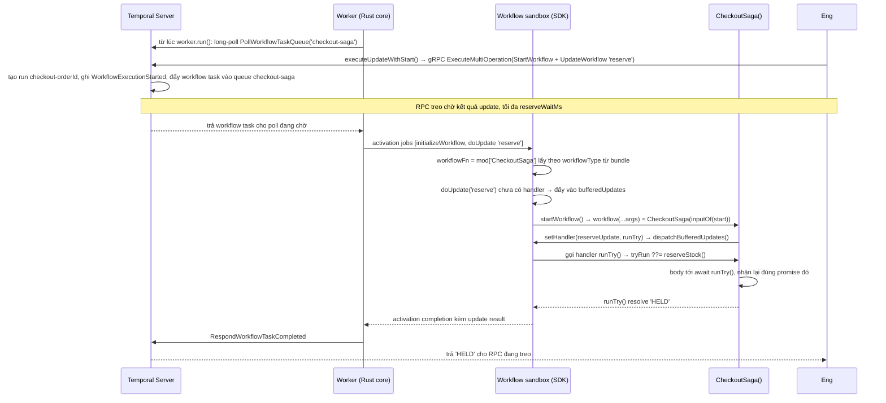

```mermaid
sequenceDiagram
  participant TS as Temporal Server
  participant Core as Worker (Rust core)
  participant SB as Workflow sandbox (SDK)
  participant WF as CheckoutSaga()
  Core->>TS: từ lúc worker.run(): long-poll PollWorkflowTaskQueue('checkout-saga')
  Eng->>TS: executeUpdateWithStart() → gRPC ExecuteMultiOperation(StartWorkflow + UpdateWorkflow 'reserve')
  TS->>TS: tạo run checkout-orderId, ghi WorkflowExecutionStarted, đẩy workflow task vào queue checkout-saga
  Note over Eng,TS: RPC treo chờ kết quả update, tối đa reserveWaitMs
  TS-->>Core: trả workflow task cho poll đang chờ
  Core->>SB: activation jobs [initializeWorkflow, doUpdate 'reserve']
  SB->>SB: workflowFn = mod['CheckoutSaga'] lấy theo workflowType từ bundle
  SB->>SB: doUpdate('reserve') chưa có handler → đẩy vào bufferedUpdates
  SB->>WF: startWorkflow() → workflow(...args) = CheckoutSaga(inputOf(start))
  WF->>SB: setHandler(reserveUpdate, runTry) → dispatchBufferedUpdates()
  SB->>WF: gọi handler runTry() → tryRun ??= reserveStock()
  WF->>WF: body tới await runTry(), nhận lại đúng promise đó
  WF-->>SB: runTry() resolve 'HELD'
  SB-->>Core: activation completion kèm update result
  Core->>TS: RespondWorkflowTaskCompleted
  TS-->>Eng: trả 'HELD' cho RPC đang treo

```
